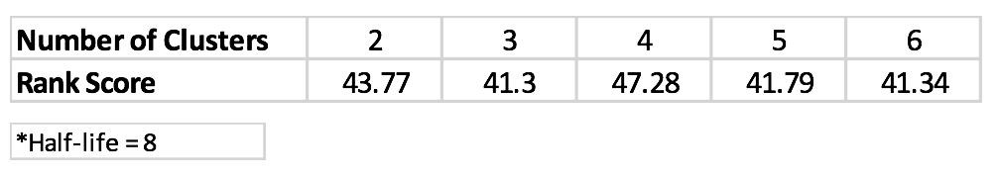

# Project 4: Collaborative Filtering

### [Project Description](doc/project4_desc.md)
### [5 Academic papers](doc/Papers)
Term: Fall 2017

+ Group 3
+ Project title: Comparison of Collaborative Filtering Algorithms
+ Team members
	+ Jordan Leung
	+ Jingkai Li
	+ Henrique Saboya
	+ Yijia Li
	+ Hongjie Ren

+ Project summary: The goal of this project is to compare a pair of algorithms from the collaborative filtering literature on Microsoft Web Dataset and EachMovie Dataset. One of the algorithms is a model-based and the other is a memory-based algorithm.

For the memory-based we used different component combinations,

For the model-based we used a naive bayseian clustering approach, with 4 clusters and a hal-life of 8 itens, achieving a rank score of 47.28 (best parameters have been chosen based on cross-validation).


	
**Contribution statement**: ([default](doc/a_note_on_contributions.md)) Four team members (Jordan Leung, Jingkai Li, Henrique Saboya, Yijia  Li) contributed equally in all stages of this project. Four team members approve our work presented in this GitHub repository including this contributions statement. 

+ Jordan Leung
        
	+ Implementation of memory-based algorithms (Similarity Weight: Mean square difference, SimRank)
+ Jingkai Li          
                
	+ Implementation of memory-based algorithms (Rating Normalization: Deviation for Mean, Z-score) 
	+ Evaluation for memory-based algorithms (different algorithms and component combinations)
+ Henrique Saboya  
               
	+ Data preprocessing, include data splitting and cleaning  
	+ Implementation of model-based algorithms (cluster model) 
	+ Evaluation for model-based algorithms (cluster model)	
	+ Generate README.md
+ Yijia  Li
        
	+ Implementation of memory-based algorithms (Selecting Neighbours: Weight Threshold, Best-n-estimator, Combined)
	+ Make the slides and give the presentation
	+ Generate README.md

Following [suggestions](http://nicercode.github.io/blog/2013-04-05-projects/) by [RICH FITZJOHN](http://nicercode.github.io/about/#Team) (@richfitz). This folder is orgarnized as follows.

```
proj/
├── lib/
├── data/
├── doc/
├── figs/
└── output/
```

Please see each subfolder for a README file.
